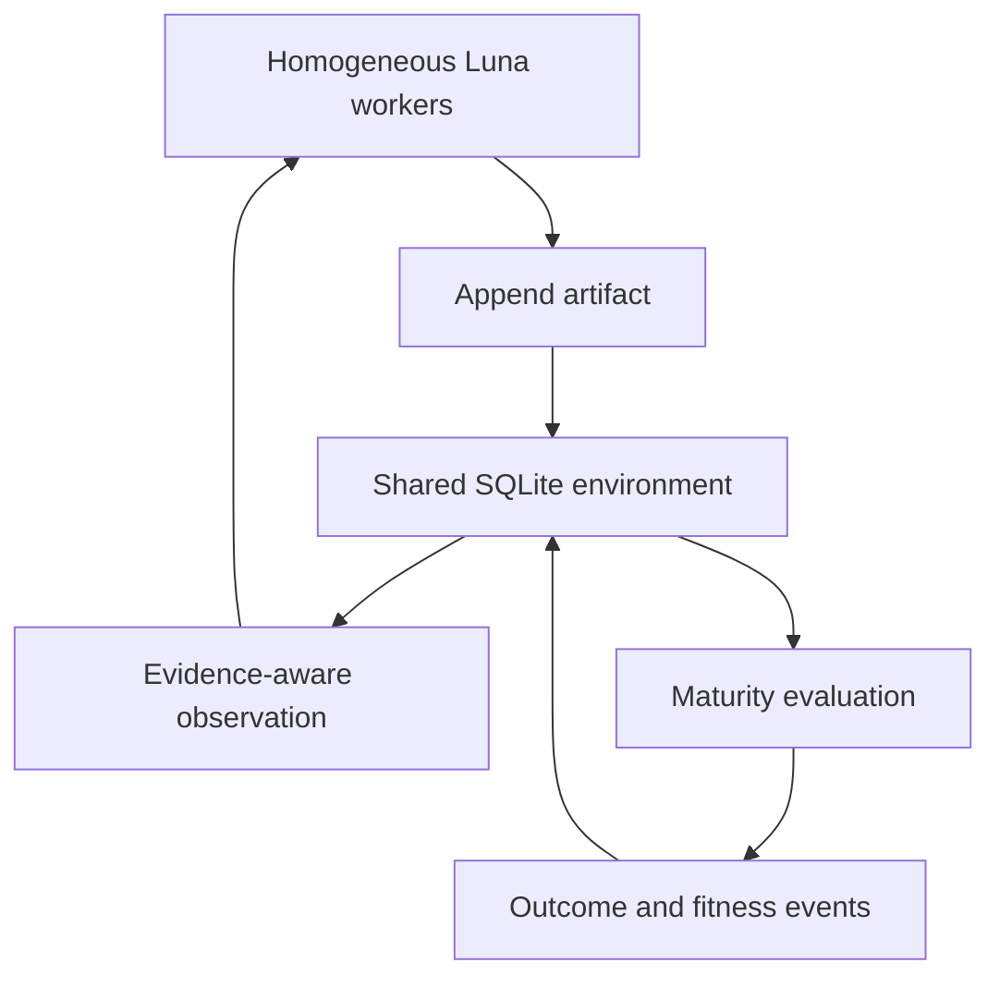

# Luna Swarm Revenue Strategy

## Scope

This extension adds a stigmergic research environment to the existing
AgentOS2/Factory OS runtime. It does not replace the queue, planner, builder,
critic, repair loop, or artifact lifecycle.

The checked-out public core does not contain a concrete `goal_queue` mutation
API or the named `artifact_feedback` constants. The integration therefore
records the requested legacy signal exactly in an append-only compatibility
ledger and emits selection/mutation/extinction recommendations without deleting
evidence:

| Event | Delta |
| --- | ---: |
| `artifact_generated` | +1 |
| `critic_pass` | +2 |
| `critic_fail` | -1 |

The legacy component is clamped to `[-5, +10]`. Extended fitness is stored
alongside it and never overwrites it.

## Artifact-mediated architecture



Workers receive the same base model name and the same ten capabilities at
bootstrap. They do not receive fixed personas or a direct-message channel.
`parent_artifacts` and `derived_from` form an immutable knowledge lineage.
Failed artifacts remain available with `FAILED` status.

The default population is 50 workers. A behavioral specialization hint is only
persisted after enough observed artifacts show both a repeated pattern and a
quality advantage. The hint is an environment-derived successful behavior, not
a permanent role.

## Implementation map

| Priority | Implemented | Boundary still closed |
| --- | --- | --- |
| P0 | Validated artifact schema, append-only SQLite/WAL store, recursive lineage, due-prediction tracking, evaluation metrics, worker budget events, legacy and extended fitness integration | A live market outcome provider is not configured |
| P1 | 50-worker asynchronous orchestration, homogeneous bootstrap, evidence clustering, minority reservation, disagreement artifacts, specialization detection, matched baselines and paired bootstrap | A production Luna inference client is not configured; offline tests use an explicit test double |
| P2 | Six intelligence routes, four price levels, discovery documents, x402 v2 header flow, signed receipt and reuse ledger, separate truth/usefulness/demand signals | The default verifier rejects all payments; a reviewed facilitator/settlement adapter is required |
| P3 | Deterministic `Decimal` paper accounting and a research-readiness gate | Paper trading remains closed until the statistical gate passes |
| P4 | Hard-disabled real-execution boundary | No broker, wallet, private-key, or order submission implementation exists |

## Artifact and evaluation rules

The schema supports:

- `prediction`, `evidence`, `counter_evidence`, `market_observation`
- `technology_signal`, `company_signal`, `anomaly`, `strategy`
- `critique`, `validation`, `outcome`, `commercial_product`

Every artifact must include provenance. Secret-like keys and values are rejected
before persistence. Records are content-hashed, and scientific tables reject
updates and deletes at the database layer.

The evaluation engine discovers matured predictions and accepts only outcomes
whose observation timestamp is between prediction maturity and the evaluation
run. Invalid temporal observations are preserved as leakage-guard anomaly
artifacts but are not scored.

Metrics include one-vs-selected-class Brier score, expected calibration error,
hit rate, information coefficient, macro directional false-positive rate,
precision, recall, uniqueness, useful signal per dollar/token, and artifact
survival.

## Anti-herding and baselines

Source URLs are normalized and lineage-derived sources are propagated into
evidence clusters. A cluster contributes at most one vote, so ten predictions
derived from the same primary source are not counted as ten independent votes.
Observation selection reserves a configurable minority share and independently
promotes counter-evidence.

Matched cases compare:

- single Luna
- pre-registered best-of-N independent Luna
- evidence-cluster-aware majority vote
- stigmergic swarm selection
- deterministic random baseline

The report includes raw and cost-adjusted Brier differences with paired
bootstrap 95% intervals. No selector can inspect realized outcomes.

## x402 product boundary

Products are exposed at:

- `/signal/{subject}`
- `/research/{subject}`
- `/risk/{subject}`
- `/event/{subject}`
- `/consensus/{subject}`
- `/counter-thesis/{subject}`

Discovery is available through `/agent.json`, `/.well-known/agent.json`,
`/payment-options.json`, `/pricing.json`, `/openapi.json`,
`/.well-known/x402/discovery/resources`, and `/llms.txt`.

Paid access is denied unless the artifact has a deterministic outcome evaluation
or a validation descendant issued by the trusted deterministic evaluator/critic
boundary. A worker cannot self-authorize paid publication. A purchase increments demand and virtual
compute budget only; it never changes the truth score. The default server also
stays `payment_ready=false` until a real verifier, payment metadata, and receipt
signer are all provided.

## Operations

Initialize the shared environment and homogeneous population without invoking a
model:

```bash
python3 -m factory.swarm.cli init --workers 50
python3 -m factory.swarm.cli status
```

Run the offline orchestration smoke test only when explicitly requested:

```bash
python3 -m factory.swarm.cli demo-round \
  --allow-test-double --workers 50 --subject NVDAc --horizon 24h
```

Evaluate matured predictions from a provenance-audited JSON mapping:

```bash
python3 -m factory.swarm.cli evaluate \
  --outcomes runtime/swarm/outcomes.json \
  --now 2026-01-03T00:00:00Z
```

Continuously poll that externally updated feed (for example, one populated by a
Financial Datasets connector outside the Python process):

```bash
python3 -m factory.swarm.cli evaluation-daemon \
  --outcomes runtime/swarm/outcomes.json --poll-seconds 60
```

The ChatGPT Financial Datasets connector is not imported or impersonated by
this process. Connector output must cross the audited JSON/provenance boundary.

The outcome file maps each immutable prediction artifact ID to:

```json
{
  "prediction-001": {
    "realized_result": 0.025,
    "realized_direction": "UP",
    "observed_at": "2026-01-02T00:01:00Z",
    "source_refs": ["https://example.test/audited-close"],
    "usefulness_score": 0.8
  }
}
```

Run the HTTP control plane:

```bash
python3 factory/api/server.py
curl http://127.0.0.1:8787/swarm/status
curl http://127.0.0.1:8787/.well-known/agent.json
```

Run tests:

```bash
python3 -m unittest discover -s factory/swarm/tests -p 'test_*.py' -v
```

## Safety boundary

- External source text is data, never an instruction.
- Artifacts reject common secret and private-key patterns.
- Outcome timestamps are checked against maturity and evaluation time.
- The x402 default is discovery-only and deny-by-default.
- Paper sizing, cash, slippage, fees, PnL, and limits use deterministic code.
- Real execution is disabled and has no adapter.
